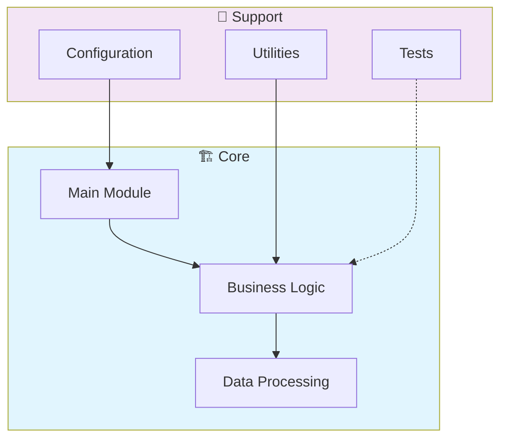

# 🚀 R Time Series Forecasting Finance

> Financial time series forecasting toolkit in R. Implements ARIMA, GARCH, Prophet, and ensemble models for stock price prediction, volatility modeling, and risk assessment.

[](https://img.shields.io/badge/)
[](LICENSE)

[English](#english) | [Português](#português)

---

## English

### 🎯 Overview

**R Time Series Forecasting Finance** is a production-grade R application that showcases modern software engineering practices including clean architecture, comprehensive testing, containerized deployment, and CI/CD readiness.

The codebase comprises **631 lines** of source code organized across **6 modules**, following industry best practices for maintainability, scalability, and code quality.

### ✨ Key Features

- **📐 Clean Architecture**: Modular design with clear separation of concerns
- **🧪 Test Coverage**: Unit and integration tests for reliability
- **📚 Documentation**: Comprehensive inline documentation and examples
- **🔧 Configuration**: Environment-based configuration management

### 🏗️ Architecture



### 🚀 Quick Start

#### Prerequisites

- R 4.3+
- RStudio (recommended)

#### Installation

```bash
# Clone the repository
git clone https://github.com/galafis/r-time-series-forecasting-finance.git
cd r-time-series-forecasting-finance
```

```r
# In R console — install dependencies
install.packages(c("tidyverse", "shiny", "ggplot2", "forecast"))
```

#### Running

```r
source("main.R")
# Or for Shiny apps:
shiny::runApp()
```

### 🧪 Testing

```r
# Run tests
testthat::test_dir("tests")
```

### 📁 Project Structure

```
r-time-series-forecasting-finance/
├── R/
│   └── models/        # Data models
│       └── arima_forecast.R
├── data/
├── examples/
│   └── basic_usage.R
├── images/
├── tests/         # Test suite
│   ├── testthat/
│   │   └── test_arima_forecast.R
│   ├── README.md
│   └── run_tests.R
├── CONTRIBUTING.md
├── DOCUMENTATION.md
├── INSTALL.R
├── LICENSE
├── QUICKSTART.md
├── README.md
└── verify_installation.R
```

### 🛠️ Tech Stack

| Technology | Description | Role |
|------------|-------------|------|
| **R** | Core Language | Primary |

### 🤝 Contributing

Contributions are welcome! Please feel free to submit a Pull Request. For major changes, please open an issue first to discuss what you would like to change.

1. Fork the project
2. Create your feature branch (`git checkout -b feature/AmazingFeature`)
3. Commit your changes (`git commit -m 'Add some AmazingFeature'`)
4. Push to the branch (`git push origin feature/AmazingFeature`)
5. Open a Pull Request

### 📄 License

This project is licensed under the MIT License - see the [LICENSE](LICENSE) file for details.

### 👤 Author

**Gabriel Demetrios Lafis**
- GitHub: [@galafis](https://github.com/galafis)
- LinkedIn: [Gabriel Demetrios Lafis](https://linkedin.com/in/gabriel-demetrios-lafis)

---

## Português

### 🎯 Visão Geral

**R Time Series Forecasting Finance** é uma aplicação R de nível profissional que demonstra práticas modernas de engenharia de software, incluindo arquitetura limpa, testes abrangentes, implantação containerizada e prontidão para CI/CD.

A base de código compreende **631 linhas** de código-fonte organizadas em **6 módulos**, seguindo as melhores práticas do setor para manutenibilidade, escalabilidade e qualidade de código.

### ✨ Funcionalidades Principais

- **📐 Clean Architecture**: Modular design with clear separation of concerns
- **🧪 Test Coverage**: Unit and integration tests for reliability
- **📚 Documentation**: Comprehensive inline documentation and examples
- **🔧 Configuration**: Environment-based configuration management

### 🏗️ Arquitetura


### 🚀 Início Rápido

#### Prerequisites

- R 4.3+
- RStudio (recommended)

#### Installation

```bash
# Clone the repository
git clone https://github.com/galafis/r-time-series-forecasting-finance.git
cd r-time-series-forecasting-finance
```

```r
# In R console — install dependencies
install.packages(c("tidyverse", "shiny", "ggplot2", "forecast"))
```

#### Running

```r
source("main.R")
# Or for Shiny apps:
shiny::runApp()
```

### 🧪 Testing

```r
# Run tests
testthat::test_dir("tests")
```

### 📁 Estrutura do Projeto

```
r-time-series-forecasting-finance/
├── R/
│   └── models/        # Data models
│       └── arima_forecast.R
├── data/
├── examples/
│   └── basic_usage.R
├── images/
├── tests/         # Test suite
│   ├── testthat/
│   │   └── test_arima_forecast.R
│   ├── README.md
│   └── run_tests.R
├── CONTRIBUTING.md
├── DOCUMENTATION.md
├── INSTALL.R
├── LICENSE
├── QUICKSTART.md
├── README.md
└── verify_installation.R
```

### 🛠️ Stack Tecnológica

| Tecnologia | Descrição | Papel |
|------------|-----------|-------|
| **R** | Core Language | Primary |

### 🤝 Contribuindo

Contribuições são bem-vindas! Sinta-se à vontade para enviar um Pull Request.

### 📄 Licença

Este projeto está licenciado sob a Licença MIT - veja o arquivo [LICENSE](LICENSE) para detalhes.

### 👤 Autor

**Gabriel Demetrios Lafis**
- GitHub: [@galafis](https://github.com/galafis)
- LinkedIn: [Gabriel Demetrios Lafis](https://linkedin.com/in/gabriel-demetrios-lafis)
